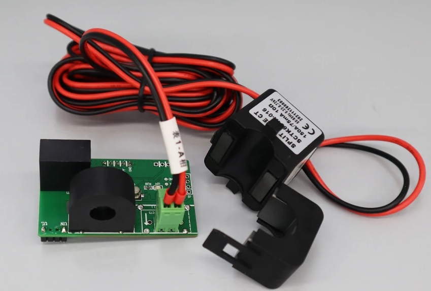

# Rust crate for JSY-MK-194

## What is JSY-MK-194 ?

JSY-MK-194 is hardware to get some informations about current, voltage, frequency of AC current.

You found this hardware easly on some chiness website.



## Test hardware

This crate has only tested on ESP32-WROOM-32 microcontroler.

## Example

First, you need provide implementation of some trait (hardware abstract):
```rust
struct MyUartImpl {
    // Some necessary fields
}

type UartError = std::io::Error;

impl crate::Uart for UartTestImpl {
    type Error = UartError;

    fn read(&mut self, buf: &mut [u8], _timeout: u32) -> Result<usize, Self::Error> {
        // Do something
    }

    fn write(&mut self, bytes: &[u8]) -> Result<usize, Self::Error> {
        // Do something
    }
}

struct MyDelayImpl {
    // Some necessary fields
}

impl DelayMs<u16> for DelayTestImpl {
    fn delay_ms(&mut self, _ms: u16) {
        // Do something
    }
}
```

Then, you need call `read()` method:
```rust
let mut jsy_my_194 = jsy_my_194::new(my_uart_impl, my_delay_impl);
jsy_my_194.read();

print!("First channel power: {}", jsy_my_194.power_1());
```

That's all!

## License

The code is released under MIT License to allow every body to use it in all conditions. I you love open-source software and this crate, please give some money to [HaikuOS](https://haiku-os.org/) or [ReactOS](https://reactos.org).
